<div align="center">

</div>

# Explorando Cairo 1.0

Nadai Cairo 1.0 es una recopilación de traducciones y pruebas realizadas sobre Cairo 1.0. Iremos añadiendo los grandes avances de algunos de los Grandes miembros de [StarknetEs](https://github.com/Starknet-Es), sigue a esta comunidad Oficial de Starknet Español en la que encontrarás mucho contenido sobre Cairo.

* [Exploring of Cairo 1.0 - dpinones](https://github.com/dpinones/exploring-of-cairo-1)
* [Cairo Installer 1.0 - dub](https://github.com/sdgalvan/cairo-installer)
* [Quaireaux](https://github.com/keep-starknet-strange/quaireaux)


Aquí hay veremos algunos ejemplos simples para mostrarle cómo funciona Cairo 1. A medida que continúe desarrollando Cairo 1, iré añadiendo mas trabajo propio, traducciones o de los compañeros de equipo para ir entrando en el nuevo Cairo. Al clonar la repo y ejecutar alguno de los ejemplos se le instalará deriectamente una version `Cairo 1.0.0 alpha2`, si se le complica puede seguir directamente el enlace de [Cairo Installer 1.0 - dub](https://github.com/sdgalvan/cairo-installer).

Recuerde que todas estas pruebas son experimentales, primero clone la repo:

```bash
gh repo clone Nadai2010/Nadai-Cairo-1.0
```


Para ejecutar los ejemplos, use el siguiente comando:

```bash
cargo run --bin cairo-run -- -p ./<path_file> 
```

Aquí un ejemplo:
```bash
cargo run --bin cairo-run -- -p ./src/var/var_1.cairo 
```

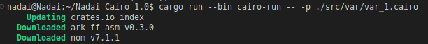
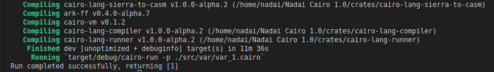

Después de 11 min aproximadmente se ha terminado la instalación, ahora procederemos a las pruebas y explicacion de cada contenido.

---

## Soporte de verisones

| [Cairo Releases](https://github.com/starkware-libs/cairo/releases/)  | Parameter |
| -------------  | ------------- |
| [v1.0.0-alpha-2](https://github.com/starkware-libs/cairo/releases/tag/v1.0.0-alpha.2)   | 1.0.0-alpha-2 |

---

### Contenido 

- [Variables]()
    - [Let](#let)
    - [Mut](#mut)
    - [Ref](#ref)
    - [Constant](#constant)
    - [Bool](#bool)
- [Debugging](#debugging)
    - [Print felt](#print-felt)
- [Conditional Statements](#conditional)
    - [Equality Operator (==)](#operator)
    - [Comparison Operators (< > <= >=)](#operators)
    - [AND Operator](#and)
    - [OR Operator](#or)
    - [Negation Operator (!)](#negation)
- [Arrays](#arrays)
    - [Creating, Appending, and Accessing Elements](#new)
    - [Length (len)](#len)
    - [Pop Front](#pop)
- [Enumerations](#enum)
- [Match Expressions](#match)


## Variables

<a id="let"></a>
### Let
Declaración de una variable. Una vez que se asigna un valor, no se puede cambiar. Se convierte en una constante.

```rust
fn main() -> felt {
    let a = 1;
    a
}
```

Aquí podremos pasar para imprimir el resultado en nuestra consola:

```bash
cargo run --bin cairo-run -- -p ./src/var/var_1.cairo 
```


<a id="mut"></a>
### Mut
Declaración de una variable mutable. De lo contrario, el valor no se puede volver a modificar.

```rust
fn main() -> felt {
    let mut b = 2;
    b = 3
    b
}
```

En el caso de `var_2.cairo` podremos pasar para imprimir el resultado en nuestra consola:

```bash
cargo run --bin cairo-run -- -p ./src/var/var_2.cairo
```


<a id="ref"></a>
### Ref
Modificación de una variable que se pasa como referencia.

```rust
fn main() -> felt {
    let mut n = 1;
    b(ref n);
    n
}

fn b(ref n: felt){
    n = 1;
}
```

En el caso de `var_3.cairo` podremos pasar para imprimir el resultado en nuestra consola:

```bash
cargo run --bin cairo-run -- -p ./src/var/var_3.cairo
```

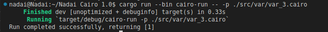

<a id="constant"></a>
### Constant
Declarando constante global.

```rust
const NUM: felt = 15;
fn main() -> felt {
    NUM
}
```

En el caso de `var_4.cairo` podremos pasar para imprimir el resultado en nuestra consola:

```bash
cargo run --bin cairo-run -- -p ./src/var/var_4.cairo
```

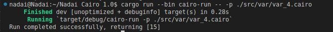

<a id="bool"></a>
### Bool

```rust
fn main() -> bool {
    let a = 25;
    if a == 15 {
        return bool::True(());
    } else {
        return bool::False(());
    }
}
```
En el caso de `var_5.cairo` podremos pasar para imprimir el resultado en nuestra consola:

```bash
cargo run --bin cairo-run -- -p ./src/var/var_5.cairo
```

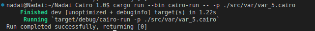

<a id="debugging"></a>
## Debugging

<a id="print-felt"></a>
### Print felt

```rust
fn main() -> felt {
    let a = 15;
    debug::print_felt('a: ');
    debug::print_felt(a);
    a
}
```

En el caso de `debug_1.cairo` podremos pasar para imprimir el resultado en nuestra consola:

```bash
cargo run --bin cairo-run -- -p ./src/debug/debug_1.cairo
```

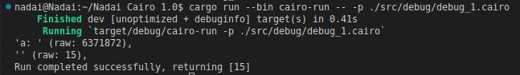

También puede hacer pruebas sientase libre para ir testeando la nueva sintaxis de Cairo 1.0  y repetir a pasar el comando, por ejemplo:

```rust
fn main() -> felt {
    let a = 15;
    debug::print_felt('Hola Mundo soy Nadai: ');
    debug::print_felt(a);
    a
}
```

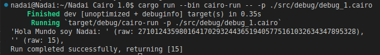


<a id="conditional"></a>
## Conditional Statements

<a id="operator"></a>
### Equality Operator (==)

```rust
fn main() {
    let x = 25;
    if x == 0 {
        debug::print_felt('x is equal to 0');
    } else if x == 1 {
        debug::print_felt('x is equal to 1');
    } else {
        debug::print_felt('x is not equal to 0 or 1');
    }
}
```

En el caso de `if_1.cairo` podremos pasar para imprimir el resultado en nuestra consola:

```bash
cargo run --bin cairo-run -- -p ./src/if/if_1.cairo
```

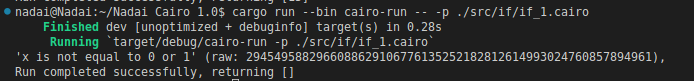


Tambien podremos probar a darle un resultado distinto a los valores y ver si nos imprime el restulado correcto, ejemplo `x == 25`

```rust
fn main() {
    let x = 25;
    if x == 25 {
        debug::print_felt('x is equal to 0');
    } else if x == 1 {
        debug::print_felt('x is equal to 1');
    } else {
        debug::print_felt('x is not equal to 0 or 1');
    }
}
```

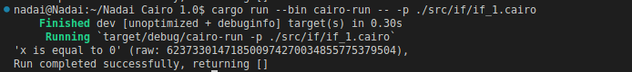

<a id="operators"></a>
### Comparison Operators (< > <= >=)

```rust
fn main() {
    let x = 10;
    let y = 20;
    if x < y {
        debug::print_felt('x is less than y');
    }
    if x <= y {
        debug::print_felt('x is less than or equal to y');
    }
    if x > y {
        debug::print_felt('x is greater than y');
    }
    if x >= y {
        debug::print_felt('x is greater than or equal to y');
    }
}
```

En el caso de `if_2.cairo` podremos pasar para imprimir el resultado en nuestra consola:

```bash
cargo run --bin cairo-run -- -p ./src/if/if_2.cairo
```

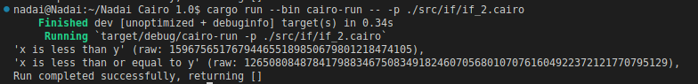

<a id="and"></a>
### AND Operator

```rust
fn main() {
    let x = 25;
    if x != 0 & x >= 25 {
        debug::print_felt('x is not equal to 0');
        debug::print_felt('and');
        debug::print_felt('x is greater than or equal to 25');
    } else {
        debug::print_felt('x is equal to 0');
    }
}
```

En el caso de `if_3.cairo` podremos pasar para imprimir el resultado en nuestra consola:

```bash
cargo run --bin cairo-run -- -p ./src/if/if_3.cairo
```

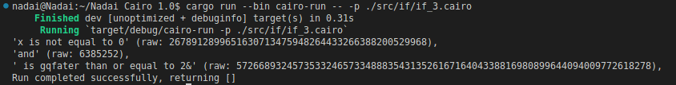

<a id="or"></a>
### OR Operator

```rust
fn main() {
    let x = 0;
    if x != 0 | x >= 25 {
        debug::print_felt('x is not equal to 0');
        debug::print_felt('or');
        debug::print_felt('x is greater than or equal to 25');
    } else {
        debug::print_felt('x is equal to 0');
        debug::print_felt('or');
        debug::print_felt('x is less than 25');
    }
}
```


En el caso de `if_4.cairo` podremos pasar para imprimir el resultado en nuestra consola:

```bash
cargo run --bin cairo-run -- -p ./src/if/if_4.cairo
```

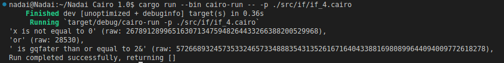

<a id="negation"></a>
### Negation Operator (!)
Una función puede ser llamada en el condicional if

```rust
fn main() {
    let age = 15;
    if !is_greater(age) {
        debug::print_felt('is less');
    } else {
        debug::print_felt('is greater');
    } 
}

fn is_greater(age: felt) -> bool {
    age >= 18
}
```

En el caso de `if_5.cairo` podremos pasar para imprimir el resultado en nuestra consola:

```bash
cargo run --bin cairo-run -- -p ./src/if/if_4.cairo
```

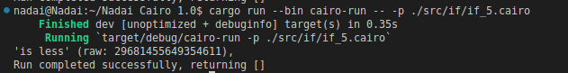

También podra probar como hemos dicho y sentirse libre de expirmentar antes de la llegada de Cairo 1.0, aquí podremo indicar que si, que somo mayores de 18

```rust
fn main() {
    let age = 18;
    if !is_greater(age) {
        debug::print_felt('is less');
    } else {
        debug::print_felt('is greater');
    } 
}

fn is_greater(age: felt) -> bool {
    age >= 18
}
```

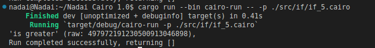

<a id="arrays"></a>
## Arrays

<a id="new"></a>
### Creating, Appending, and Accessing Elements

```rust
use array::ArrayTrait;

fn main() {
    let mut arr = ArrayTrait::new();
    arr.append(10);
    arr.append(11);
    arr.append(12);
    let pos2 = arr.at(2_usize);
    debug::print_felt(pos2);
}
```

En el caso de `array_1.cairo` podremos pasar para imprimir el resultado en nuestra consola:

```bash
cargo run --bin cairo-run -- -p ./src/array/array_1.cairo
```

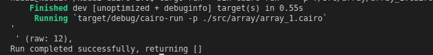


<a id="len"></a>
### Length (len)

```rust
use array::ArrayTrait;

fn main() -> usize {
    let mut arr = ArrayTrait::new();
    arr.append(10);
    arr.append(11);
    arr.append(12);
    arr.len()
}
```

En el caso de `array_2.cairo` podremos pasar para imprimir el resultado del `len` del array en nuestra consola:

```bash
cargo run --bin cairo-run -- -p ./src/array/array_2.cairo
```


<a id="pop"></a>
### Pop Front

```rust
use array::ArrayTrait;

fn main() {
    let mut arr = ArrayTrait::new();
    arr.append(10);
    arr.append(11);
    arr.append(12);
    
    match arr.pop_front() {
        Option::Some(x) => {
            debug::print_felt(x);    
        },
        Option::None(_) => {
            debug::print_felt('None');
        },
    };
}
```

En el caso de `array_3.cairo` podremos pasar para imprimir el resultado en nuestra consola:

```bash
cargo run --bin cairo-run -- -p ./src/array/array_3.cairo
```

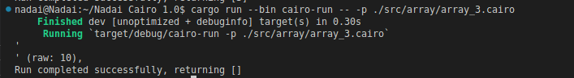

<a id="enum"></a>
## Enumerations

```rust
enum MyEnumShort {
    a: felt,
    b: felt
}

fn main() -> felt {
    let es0 = MyEnumShort::a(10);
    match_short(es0)
}

fn match_short(e: MyEnumShort) -> felt {
    match e {
        MyEnumShort::a(x) => {
            x
        },
        MyEnumShort::b(x) => {
            x * 2
        },
    }
}
```

En el caso de `enum_1.cairo` podremos pasar para imprimir el resultado en nuestra consola:

```bash
cargo run --bin cairo-run -- -p ./src/enum/enum_1.cairo
```

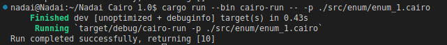


<a id="match"></a>
## Match Expressions
No se admite la coincidencia con un valor distinto de cero.

```rust
fn main() -> felt {
    let a = 25;
    match_test(a)
}

fn match_test(a: felt) -> felt {
    match a {
        0 => 15, 
        _ => 0,
    }
}
```

En el caso de `match_1.cairo` podremos pasar para imprimir el resultado en nuestra consola:

```bash
cargo run --bin cairo-run -- -p ./src/match/match_1.cairo
```

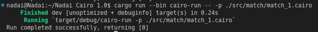

## Autores y agredecimentos ✨

<table>
  <tbody>
    <tr>
      <td align="center" valign="top" width="14.28%"><a href="https://twitter.com/dpinoness"><br /><sub><b>@dpinoness</b></sub></a><br /><a href="https://twitter.com/dpinoness" title="Twitter"></a></td>
      <td align="center" valign="top" width="14.28%"><a href="https://twitter.com/dub_zn"><br /><sub><b>@dub_zn</b></sub></a><br /><a href="https://twitter.com/dub_zn" title="Twitter"></a></td>
      <td align="center" valign="top" width="14.28%"><a href="https://twitter.com/StarkNetEs"><br /><sub><b>@StarkNetEs</b></sub></a><br /><a href="https://twitter.com/StarkNetEs" title="Twitter"></a></td>
    </tr>
  </tbody>
</table>

